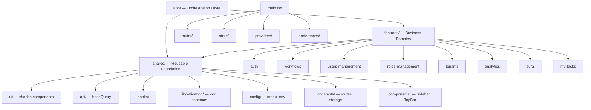
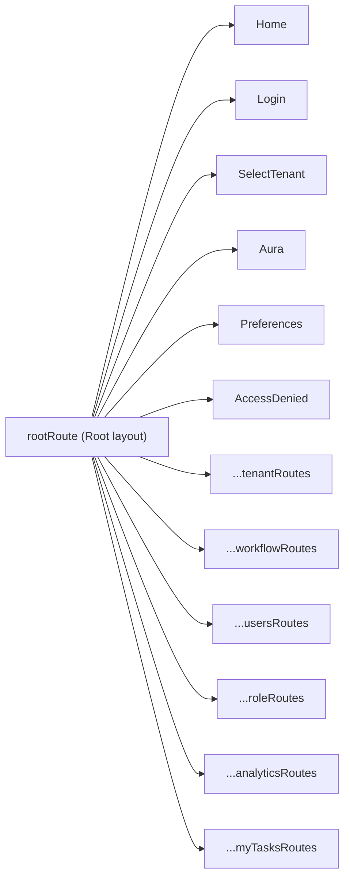
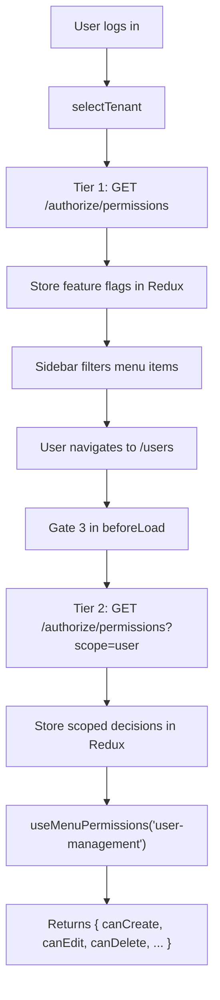

# sp-web Architecture Walkthrough
## React + shadcn/ui + TanStack Router + RTK Query

---

## 1. High-Level Architecture

The codebase follows a **Feature-Sliced Design** (FSD) pattern with three clear layers:



| Layer | Path | Responsibility |
|-------|------|---------------|
| **app/** | `src/app/` | Entry point, router, Redux store, providers, guards |
| **features/** | `src/features/` | Domain-specific logic (pages, services, hooks, components) |
| **shared/** | `src/shared/` | Cross-cutting: UI primitives, API client, schemas, hooks |

---

## 2. Technology Stack Summary

| Concern | Technology | Notes |
|---------|-----------|-------|
| UI Framework | **React 19** | Latest, strict mode enabled |
| Routing | **TanStack Router v1** | Type-safe, code-split via `lazy()` |
| State / Server Cache | **Redux Toolkit + RTK Query** | Per-feature `createApi()` slices |
| UI Components | **shadcn/ui** (Radix + CVA + Tailwind) | 25+ primitives in `shared/ui/` |
| Tables | **TanStack Table v8** | Wrapped in `DataTable` component |
| Styling | **Tailwind CSS v3** + CSS variables | HSL theming, dark mode via class |
| Validation | **Zod** | Shared schemas → type inference + runtime checks |
| i18n | **i18next + react-i18next** | Browser language detection |
| Build | **Vite 7** + SWC | Fast HMR, path aliases |
| Testing | **Vitest + Testing Library + MSW** | Mocks for API layer |

---

## 3. Routing — TanStack Router

### 3.1 How it works

Routes are defined **imperatively** using `createRoute()` and `createRootRoute()`, not file-based.

> [!IMPORTANT]
> The codebase does **not** use TanStack Router's file-based routing. All routes are manually wired in [index.tsx](file:///c:/Projects/SuperPersova/sp-web/src/app/router/index.tsx).

**Key patterns:**



### 3.2 `createProtectedRoute()` — The Auth Guard Factory

This is the **central guard mechanism**. Every protected route goes through a 3-gate `beforeLoad` pipeline:

| Gate | Check | Speed |
|------|-------|-------|
| **Gate 1** | Auth status (`idle` → login redirect, `needsTenant` → tenant-select) | Instant |
| **Gate 2** | Tier 1 feature flags (Redux store, no network) | Instant |
| **Gate 3** | Tier 2 scoped permissions (lazy-loaded from API, awaited) | Network call on first visit |

```typescript
// Usage pattern:
const workflowsRoute = createProtectedRoute({
  path: ROUTES.app.workflows,
  component: WorkflowManagementPage,
  required: ['WORKFLOW:MANAGE'],  // ← PDS action keys
});
```

### 3.3 Route Module Pattern

Each feature exports a `create*Routes()` factory function called from the main router:

```typescript
// workflowRoutes.tsx
export function createWorkflowRoutes(rootRoute, createProtectedRoute) {
  const workflowsRoute = createProtectedRoute({ path, component, required });
  // ...
  return [workflowsRoute, workflowBuilderRoute, ...] as const;
}
```

> [!TIP]
> **Code splitting** is handled via `lazy()` at the route module level — each page component is lazily imported, and the `ProgressBar` component provides visual loading feedback.

### 3.4 Route Constants — Single Source of Truth

Routes use a triple-mapping system in [routes.ts](file:///c:/Projects/SuperPersova/sp-web/src/shared/constants/routes.ts):

- `ROUTES` — path strings (used in route definitions)
- `ROUTE_IDS` — stable enum-like IDs (used in code)
- `ROUTE_PATHS` — maps ID → path (used by `navigateById()`)

This decouples navigation from path strings, making path changes safe.

---

## 4. State Management — Redux Toolkit + RTK Query

### 4.1 Store Architecture

The store in [store/index.ts](file:///c:/Projects/SuperPersova/sp-web/src/app/store/index.ts) has **7 API slices + 2 UI slices**:

| Slice | Type | Feature |
|-------|------|---------|
| `authApi` | RTK Query | Login, tenant selection, permissions |
| `tenantApi` | RTK Query | Tenant CRUD |
| `userApi` | RTK Query | User management |
| `roleApi` | RTK Query | Role management |
| `workflowApi` | RTK Query | Workflow definitions/instances |
| `analyticsApi` | RTK Query | Analytics data |
| `approvalsApi` | RTK Query | Workflow approvals |
| `auth` | Redux slice | Auth state (token, user, permissions) |
| `preferences` | Redux slice | UI preferences (theme, sidebar, density) |

### 4.2 RTK Query Service Pattern

Each feature has a `*.service.ts` that defines a `createApi()`:

```typescript
// features/users-management/services/user.service.ts
export const userApi = createApi({
  reducerPath: 'userApi',
  baseQuery: baseQuery,              // ← shared base query with auth
  tagTypes: ['Users', 'User', 'Stats'],
  endpoints: (builder) => ({
    getUsers: builder.query<UsersListResponse, UserQuery | void>({
      query: (params) => ({ url: API_ROUTES.members.list, method: 'POST', body: params }),
      transformResponse: (res) => ({ rows: normalizeIds(res?.data?.rows), ... }),
      providesTags: ['Users'],
    }),
    updateUserStatus: builder.mutation<any, { userId: string; status: UserStatus }>({
      query: ({ userId, status }) => ({ ... }),
      invalidatesTags: (_, __, { userId }) => ['Users', { type: 'User', id: userId }, 'Stats'],
    }),
  }),
});
// Auto-generated hooks:
export const { useGetUsersQuery, useUpdateUserStatusMutation, ... } = userApi;
```

### 4.3 `baseQuery` — Enterprise-Grade API Client

[baseQuery.ts](file:///c:/Projects/SuperPersova/sp-web/src/shared/api/baseQuery.ts) wraps `fetchBaseQuery` with:

| Feature | Description |
|---------|------------|
| **Auto-auth headers** | `Authorization: Bearer <token>` added by default |
| **Multi-tenant headers** | `X-Tenant-Id` injected automatically |
| **Opt-out per endpoint** | `extraOptions: { authAware: false, tenantAware: false }` |
| **Auto token refresh** | Intercepts 401 → refreshes → retries original request |
| **Response time logging** | Emoji-based console logging (⚡ < 100ms, 🐌 > 1s) |

### 4.4 State Persistence

The store subscribes to its own changes and persists to `localStorage`:
- **Auth state** (tokens, user, permissions) → hydrated on app start
- **Preferences** (theme, sidebar, language) → hydrated on app start
- **Last tenant ID** → per-user key for quick re-login

---

## 5. shadcn/ui — Component Library

### 5.1 Configuration

[components.json](file:///c:/Projects/SuperPersova/sp-web/components.json) defines:
- Style: `default`
- RSC: `false` (client-only SPA)
- CSS: `src/shared/styles/index.css` (HSL CSS variables)
- Aliases: `@/shared/ui`, `@/shared/lib`, `@/shared/hooks`

### 5.2 Component Inventory (25+ primitives)

Located in [shared/ui/](file:///c:/Projects/SuperPersova/sp-web/src/shared/ui):

| Category | Components |
|----------|-----------|
| **Layout** | Card, Separator, Resizable (panels) |
| **Forms** | Button, Input, Textarea, Select, Checkbox, Switch, Slider, Label |
| **Data Display** | Table, DataTable, Badge, Tooltip |
| **Feedback** | AlertDialog, Dialog, ConfirmDialog, Sonner (toasts) |
| **Navigation** | Tabs, DropdownMenu, PrefetchLink |
| **Charts** | charts/ subdirectory (Recharts wrappers) |
| **Icons** | Custom icon library (14KB, Lucide-based) |

### 5.3 Component Pattern (CVA + cn)

All shadcn components follow the same pattern:

```typescript
// button.tsx
const buttonVariants = cva(
  'inline-flex items-center justify-center ...',
  {
    variants: {
      variant: { default: '...', destructive: '...', outline: '...', ghost: '...' },
      size: { default: 'h-10 px-4', sm: 'h-9 px-3', lg: 'h-11 px-8', icon: 'h-10 w-10' },
    },
    defaultVariants: { variant: 'default', size: 'default' },
  },
);

const Button = React.forwardRef<HTMLButtonElement, ButtonProps>(
  ({ className, variant, size, asChild = false, ...props }, ref) => {
    const Comp = asChild ? Slot : 'button';
    return <Comp className={cn(buttonVariants({ variant, size, className }))} ref={ref} {...props} />;
  },
);
```

> [!NOTE]
> The `cn()` utility in [utils.ts](file:///c:/Projects/SuperPersova/sp-web/src/shared/lib/utils.ts) combines `clsx` + `twMerge` to safely merge Tailwind classes with override support.

### 5.4 Composite Components (Higher-Level)

Located in [shared/components/](file:///c:/Projects/SuperPersova/sp-web/src/shared/components):

| Component | Purpose |
|-----------|---------|
| `Sidebar` | Main navigation, permission-filtered, collapsible |
| `TopBar` | App header with user menu, tenant switcher |
| `LabelInputField` | Form field with label + validation |
| `SearchableSelectField` | Searchable dropdown with multi-select |
| `PageHeader` | Consistent page title component |
| `ResourceWorkflowStage` | Workflow stage display in resource views |
| `PaginationControls` | Reusable pagination UI |

---

## 6. TanStack Table

### 6.1 DataTable Wrapper

[data-table.tsx](file:///c:/Projects/SuperPersova/sp-web/src/shared/ui/data-table.tsx) is a **generic wrapper** around `useReactTable`:

```typescript
export function DataTable<TData, TValue>({ columns, data, loading, emptyMessage }) {
  const table = useReactTable({
    data,
    columns,
    state: { sorting, columnVisibility, rowSelection, columnFilters },
    getCoreRowModel: getCoreRowModel(),
    getFilteredRowModel: getFilteredRowModel(),
    getPaginationRowModel: getPaginationRowModel(),
    getSortedRowModel: getSortedRowModel(),
    getFacetedRowModel: getFacetedRowModel(),
    getFacetedUniqueValues: getFacetedUniqueValues(),
  });
  // renders Table > TableHeader > TableBody with loading/empty states
}
```

### 6.2 Pagination Hooks

Two pagination hooks support both client and server patterns:

| Hook | Location | Use Case |
|------|----------|----------|
| `usePagination<T>` | [usePagination.ts](file:///c:/Projects/SuperPersova/sp-web/src/shared/hooks/usePagination.ts) | Client-side: slices an array, handles desktop pages + mobile infinite scroll |
| `useServerPagination<T>` | [useServerPagination.ts](file:///c:/Projects/SuperPersova/sp-web/src/shared/hooks/useServerPagination.ts) | Server-side: generates `{ page, pageSize }` query params, same UI interface |

Both auto-detect mobile (`< 768px`) and switch between paginated/infinite-scroll modes.

---

## 7. Validation Layer — Zod

### 7.1 Schema Organization

All Zod schemas live in [shared/lib/validation/](file:///c:/Projects/SuperPersova/sp-web/src/shared/lib/validation):

| File | Contents |
|------|----------|
| `authSchemas.ts` | Login, refresh, tenant selection DTOs |
| `permissionSchemas.ts` | Feature flags, permission decisions |
| `userSchemas.ts` | User, Role, Invitation, API request/response shapes |
| `tenantSchemas.ts` | Tenant CRUD shapes |
| `roleSchemas.ts` | Role management |
| `workflowSchemas.ts` | Workflow definition, instance, stage types |
| `subscriptionSchemas.ts` | Subscription tier data |

### 7.2 Schema → Type Pattern

```typescript
// Define schema once:
export const UserSummarySchema = z.object({
  id: z.string(),
  displayName: z.string(),
  status: UserStatusEnum,
  // ...
});

// Infer TypeScript type:
export type UserSummary = z.infer<typeof UserSummarySchema>;

// Use in RTK Query:
getUsers: builder.query<UsersListResponse, UserQuery | void>({ ... })
```

> [!TIP]
> Currently, Zod schemas are primarily used for **type inference** (`z.infer`), not runtime validation in API responses. The `TODO` in `userSchemas.ts` notes a planned migration to add runtime `.parse()` calls.

---

## 8. Permission System

The permission system is a **2-tier cascade** driven by [menu.config.ts](file:///c:/Projects/SuperPersova/sp-web/src/shared/config/menu.config.ts):



### Key hooks:
- `usePermission('USER:CREATE')` — single action check
- `useMenuPermissions('user-management')` — returns all named booleans for a feature area

---

## 9. Feature Module Pattern

Each feature in `src/features/` follows a consistent internal structure:

```
features/workflows/
├── api/                     # RTK Query mock API (workflowApi.mock.ts)
├── components/              # UI components (grouped by concern)
│   ├── RuleBuilder/
│   ├── WorkflowExecution/
│   ├── WorkflowIntegration/
│   └── WorkflowManagement/
├── hooks/                   # React hooks (useWorkflowTrigger.ts)
├── pages/                   # Page-level components
│   ├── WorkflowManagementPage.tsx
│   ├── WorkflowBuilderPage.tsx
│   └── WorkflowDetailPage.tsx
├── rules/                   # Business rules
├── services/                # Service layer (API abstraction)
├── utils/                   # Pure helpers
├── examples/                # Usage examples
├── index.ts                 # Barrel exports
└── WORKFLOW_SYSTEM.md       # Feature documentation
```

### Separation of Concerns (workflows example):

| Layer | File | Role |
|-------|------|------|
| **Service** | `workflowService.ts` | Raw `fetch()` calls to API endpoints |
| **RTK Query API** | `workflowApi.mock.ts` | `createApi()` with mock data (dev) |
| **Hook** | `useWorkflowTrigger.ts` | React state + service calls + UI logic |
| **Page** | `WorkflowManagementPage.tsx` | Composes components + hooks |
| **Barrel** | `index.ts` | Clean public API exports |

> [!WARNING]
> The workflows feature has **two API patterns** coexisting: a plain `fetch()`-based service (`workflowService.ts`) and an RTK Query `createApi()` mock (`workflowApi.mock.ts`). This is a transitional state — new features should prefer RTK Query exclusively.

---

## 10. Provider Chain

The app wraps in a specific provider order in [main.tsx](file:///c:/Projects/SuperPersova/sp-web/src/app/main.tsx):

```
StrictMode
  └─ HeadProvider           (document head management)
      └─ Redux Provider     (state)
          └─ ThemeProvider   (dark mode via next-themes)
              └─ I18nProvider (i18next)
                  └─ ErrorBoundary
                      ├─ RouterProvider  (TanStack Router)
                      └─ Toaster        (Sonner notifications)
```

---

## 11. Quick Reference: Where Things Live

| Need to... | Go to... |
|------------|----------|
| Add a new page | `src/features/<feature>/pages/` + register in `src/app/router/` |
| Add a new API endpoint | `src/features/<feature>/services/*.service.ts` |
| Add a shadcn component | `npx shadcn-ui add <component>` → lands in `src/shared/ui/` |
| Add a shared hook | `src/shared/hooks/` |
| Define a new data type | `src/shared/lib/validation/*Schemas.ts` |
| Add a nav menu item | `src/shared/config/menu.config.ts` |
| Define a new route path | `src/shared/constants/routes.ts` (ROUTES + ROUTE_IDS + ROUTE_PATHS) |
| Add a Redux slice | Feature's `model/` dir + register in `src/app/store/index.ts` |
| Add permissions to a feature | `menu.config.ts` (permissions map) + `createProtectedRoute({ required })` |

---

## 12. Strengths & Areas for Improvement

### ✅ What's Working Well

1. **Clear layering** — `app/features/shared` separation is consistent and enforced
2. **Permission system** — Sophisticated 2-tier cascade with lazy-loading and menu-driven config
3. **RTK Query adoption** — Tag-based cache invalidation, auto-generated hooks
4. **Type safety** — Zod schemas → TypeScript types, end-to-end
5. **Code splitting** — `lazy()` imports per route/page
6. **Responsive design** — Dual pagination modes (desktop/mobile) baked into shared hooks

### ⚠️ Areas to Watch

| Area | Observation |
|------|-------------|
| **Dual API patterns** | `workflowService.ts` uses raw `fetch()` while `workflowApi.mock.ts` uses RTK Query. Should consolidate to RTK Query only |
| **No runtime validation** | Zod schemas exist but `.parse()` is rarely called on API responses. A middleware or `transformResponse` pattern could enforce this |
| **Large page components** | `WorkflowBuilderPage.tsx` is 48KB — could benefit from decomposition |
| **Store hydration** | Manual `dispatch({ type: '...' })` calls for hydration instead of typed action creators |
| **No React Query** | Uses RTK Query exclusively (fine, just noting — no TanStack Query despite using TanStack Router/Table) |
| **Mock data in services** | `workflowApi.mock.ts` (46KB) ships in the bundle — should move to MSW or conditional imports |
