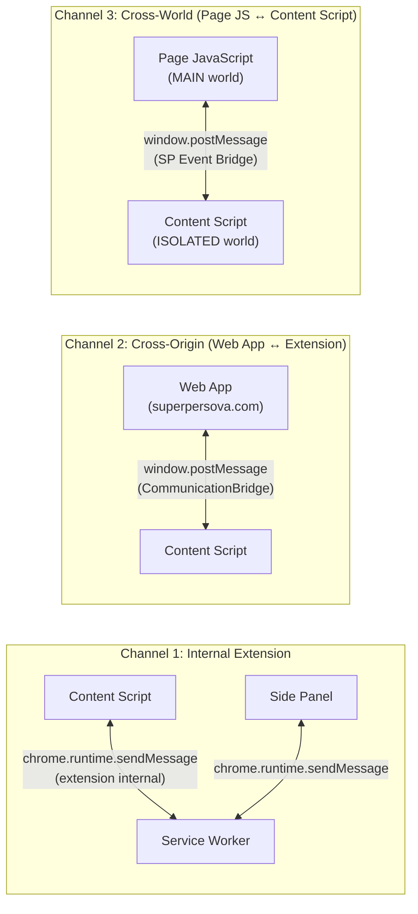
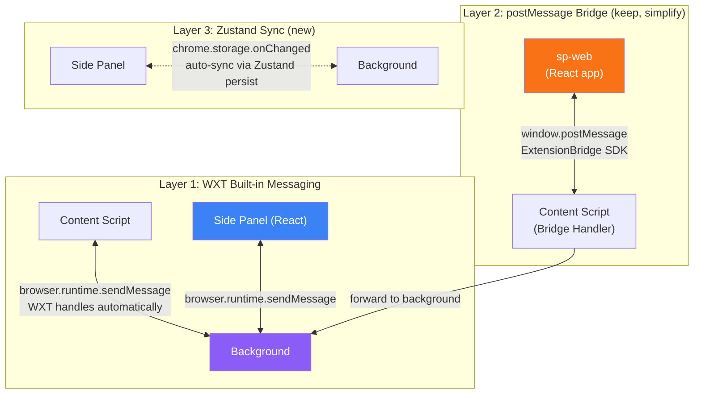

# Communication Bridge Analysis
## Do You Need a Separate Bridge?

> **Last Updated:** 2026-04-28  
> **Status:** Analysis complete — bridge simplification recommended  
> **Related Docs:**  
> - [extension_migration_plan.md](./extension_migration_plan.md) — WXT + React migration plan  
> - [sp_browser_ext_walkthrough.md](./sp_browser_ext_walkthrough.md) — Current architecture  
> - [handler_scalability_analysis.md](./handler_scalability_analysis.md) — Handler system  

---

## Critical Finding

After tracing every import and usage across both codebases:

> **sp-web has ZERO bridge integration code.**

| What I searched | sp-web result |
|----------------|---------------|
| `postMessage` | ❌ Not found |
| `sp-extension` / `sp-content-script` | ❌ Not found |
| `ext.handshake` / `storage.read` | ❌ Not found |
| `ExtensionBridge` class | ❌ Not found |

The `COMMUNICATION-PROTOCOL.md` docs show example Angular/React code, but **none of it is implemented in sp-web yet**. The bridge currently only runs inside the extension itself (content script initializes it, acelucid-placement uses it).

---

## Answer: You Don't Need TWO Bridges — You Need a Cleaner ONE

Your current architecture has a **single communication bridge class** used in the content script. The question is how it should evolve. Here's the architecture:

### What You Have (3 communication channels, 1 custom bridge)



### What You Should Have (with WXT)



---

## The 3 Layers Explained

### Layer 1: WXT Messaging (replaces your `chrome.runtime.sendMessage` calls)

WXT provides this for free — type-safe, promise-based, automatic serialization.

```typescript
// In WXT, content script → background is just:
const response = await browser.runtime.sendMessage({ 
  action: 'CAPTURE_CONTEXT', 
  data: contextData 
});

// No custom bridge needed for internal extension communication
```

**Action:** Remove `CommunicationBridge` usage for internal extension messages. Use WXT's built-in messaging.

### Layer 2: postMessage Bridge (KEEP but simplify — this is for Web App ↔ Extension)

This is the **only channel that actually needs a custom bridge**. It crosses the web page origin boundary, which `chrome.runtime.sendMessage` cannot do.

**Current bridge (651 lines)** does too much — it handles both internal routing AND cross-origin messaging. Strip it down to **only** handle cross-origin `window.postMessage`:

```typescript
// Simplified bridge — extension side (content script)
// ~100 lines instead of 651

export function setupExtensionBridgeListener() {
  window.addEventListener('message', async (event) => {
    // 1. Origin check
    if (!ALLOWED_ORIGINS.includes(event.origin)) return;
    
    // 2. Validate message structure
    const msg = event.data;
    if (msg?.target !== 'sp-content-script' || !msg?.type || !msg?.requestId) return;
    
    // 3. Route to handler
    let result: any;
    try {
      switch (msg.type) {
        case 'auth.getToken':
          result = await handleAuthGetToken(msg.payload);
          break;
        case 'auth.setToken':
          result = await handleAuthSetToken(msg.payload);
          break;
        case 'auth.status':
          result = await handleAuthStatus(msg.payload);
          break;
        case 'storage.read':
          result = await handleStorageRead(msg.payload);
          break;
        case 'storage.write':
          result = await handleStorageWrite(msg.payload);
          break;
        case 'ext.handshake':
          result = await handleHandshake(msg.payload);
          break;
        default:
          throw new Error(`Unknown message type: ${msg.type}`);
      }
      
      // 4. Send success response
      window.postMessage({
        requestId: msg.requestId,
        type: 'response.success',
        source: 'sp-content-script',
        target: 'sp-web-app',
        success: true,
        payload: result,
      }, event.origin);
      
    } catch (error) {
      window.postMessage({
        requestId: msg.requestId,
        type: 'response.error',
        source: 'sp-content-script',
        target: 'sp-web-app',
        success: false,
        error: { code: 'UNKNOWN_ERROR', message: error.message },
      }, event.origin);
    }
  });
}
```

### Layer 3: Zustand Sync (NEW — replaces manual state syncing)

Currently, the side panel reads from `storageService` on every page load (since each page is a fresh HTML). With React SPA + Zustand:

```typescript
// Zustand persist with chrome.storage = automatic sync
// Side panel, background, and content script all see the same state
const useAuthStore = create(persist(
  (set) => ({ token: null, user: null, ... }),
  { name: 'sp-auth', storage: chromeStorageAdapter }
));
```

No bridge needed for extension-internal state.

---

## What Needs to Be Built for sp-web

sp-web needs a **thin client SDK** to talk to the extension. This lives in `@superpersova/shared` or as a standalone hook:

```typescript
// packages/shared/src/extension-bridge/client.ts
// This is what sp-web imports — ~80 lines

export class ExtensionBridgeClient {
  private pending = new Map<string, { resolve: Function; reject: Function; timeout: number }>();
  private _isAvailable = false;
  
  get isAvailable() { return this._isAvailable; }

  initialize(): void {
    window.addEventListener('message', (event) => {
      const msg = event.data;
      if (msg?.source !== 'sp-content-script' || !msg?.requestId) return;
      
      const pending = this.pending.get(msg.requestId);
      if (!pending) return;
      
      clearTimeout(pending.timeout);
      this.pending.delete(msg.requestId);
      
      msg.success ? pending.resolve(msg.payload) : pending.reject(new Error(msg.error?.message));
    });
  }

  async send<T>(type: string, payload: any, timeoutMs = 5000): Promise<T> {
    const requestId = `${Date.now()}_${Math.random().toString(36).slice(2, 9)}`;
    
    return new Promise((resolve, reject) => {
      const timeout = window.setTimeout(() => {
        this.pending.delete(requestId);
        reject(new Error(`Extension bridge timeout: ${type}`));
      }, timeoutMs);
      
      this.pending.set(requestId, { resolve, reject, timeout });
      
      window.postMessage({
        version: '1.0.0',
        requestId,
        type,
        source: 'sp-web-app',
        target: 'sp-content-script',
        timestamp: Date.now(),
        payload,
      }, '*');
    });
  }

  // Convenience methods
  async handshake() { return this.send<ExtHandshakeResponse>('ext.handshake', { appVersion: '1.0.0' }); }
  async getToken(type = 'access') { return this.send<AuthGetTokenResponse>('auth.getToken', { tokenType: type }); }
  async setToken(token: string, type = 'access', expiresIn?: number) { 
    return this.send<AuthSetTokenResponse>('auth.setToken', { token, tokenType: type, expiresIn }); 
  }
  async getAuthStatus() { return this.send<AuthStatusResponse>('auth.status', {}); }
  async readStorage(scope: string, keys?: string[]) { return this.send<StorageReadResponse>('storage.read', { scope, keys }); }
  
  // Detection: is the extension installed?
  async detectExtension(timeoutMs = 2000): Promise<boolean> {
    try {
      await this.handshake();
      this._isAvailable = true;
      return true;
    } catch {
      this._isAvailable = false;
      return false;
    }
  }
}

export const extensionBridge = new ExtensionBridgeClient();
```

```tsx
// React hook for sp-web
// hooks/useExtensionBridge.ts

import { useState, useEffect } from 'react';
import { extensionBridge } from '@superpersova/shared/extension-bridge';

export function useExtensionBridge() {
  const [isAvailable, setIsAvailable] = useState(false);
  const [isChecking, setIsChecking] = useState(true);

  useEffect(() => {
    extensionBridge.initialize();
    extensionBridge.detectExtension(2000)
      .then(setIsAvailable)
      .finally(() => setIsChecking(false));
  }, []);

  return { isAvailable, isChecking, bridge: extensionBridge };
}

// Usage in sp-web:
function App() {
  const { isAvailable, bridge } = useExtensionBridge();
  
  // SSO: if extension has a token, use it
  useEffect(() => {
    if (isAvailable) {
      bridge.getAuthStatus().then(status => {
        if (status.isAuthenticated) {
          // Auto-login using extension token
          bridge.getToken().then(({ token }) => {
            if (token) dispatch(setAuthToken(token));
          });
        }
      });
    }
  }, [isAvailable]);
}
```

---

## Summary: What Changes

| Concern | Current | After WXT Migration |
|---------|---------|-------------------|
| Content Script ↔ Service Worker | `chrome.runtime.sendMessage` (manual) | WXT built-in `browser.runtime.sendMessage` (same, but bundled) |
| Side Panel ↔ Service Worker | `chrome.runtime.sendMessage` | WXT messaging OR Zustand sync via `chrome.storage` |
| Web App ↔ Extension | `CommunicationBridge` (651 lines, unused by sp-web) | Simplified postMessage listener (~100 lines) + client SDK (~80 lines) |
| AI Handler ↔ Service Worker | `chrome.tabs.sendMessage` + custom events | Same (handler injection is unchanged) |
| Page JS ↔ Content Script | SP Event Bridge (MAIN ↔ ISOLATED world) | Same (WXT doesn't change this) |

### Net result:
- **Delete**: 651-line `CommunicationBridge` class
- **Keep**: postMessage channel for cross-origin web app communication (simplified to ~100 lines)
- **Add**: ~80 line client SDK in `@superpersova/shared` for sp-web to consume
- **Gain**: WXT built-in messaging for all internal extension communication
- **Gain**: Extension auto-detection + SSO in sp-web

---

## Additional Suggestions

### 1. Add Event-Based Pub/Sub for Real-Time Sync

Right now the bridge is request/response only. Add **push events** so the extension can notify the web app of state changes:

```typescript
// Extension side: push auth state changes to web app
chrome.storage.onChanged.addListener((changes) => {
  if (changes.accessToken) {
    window.postMessage({
      type: 'event.auth.changed',
      source: 'sp-content-script',
      target: 'sp-web-app',
      payload: { 
        isAuthenticated: !!changes.accessToken.newValue,
        // Don't send the actual token in events — web app should request it
      },
    }, '*');
  }
});
```

### 2. Add Extension Detection Indicator in sp-web

Show users whether the extension is installed:

```tsx
// In sp-web TopBar or settings
function ExtensionStatus() {
  const { isAvailable } = useExtensionBridge();
  return (
    <Badge variant={isAvailable ? 'success' : 'outline'}>
      {isAvailable ? '🔗 Extension Connected' : 'Extension Not Detected'}
    </Badge>
  );
}
```

### 3. Use `externally_connectable` Instead of postMessage (Future)

For tighter security, Chrome supports direct messaging from web apps to extensions:

```jsonc
// manifest.json
{
  "externally_connectable": {
    "matches": ["https://superpersova.com/*", "https://staging.superpersova.com/*"]
  }
}
```

```typescript
// sp-web can then call:
chrome.runtime.sendMessage(EXTENSION_ID, { type: 'auth.getToken', ... });
// No content script needed as relay!
```

This eliminates the content script relay entirely for web app communication. Consider this as a future upgrade — it requires knowing the extension ID at build time and doesn't work on Firefox.
