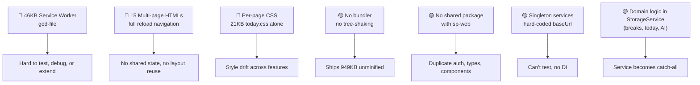
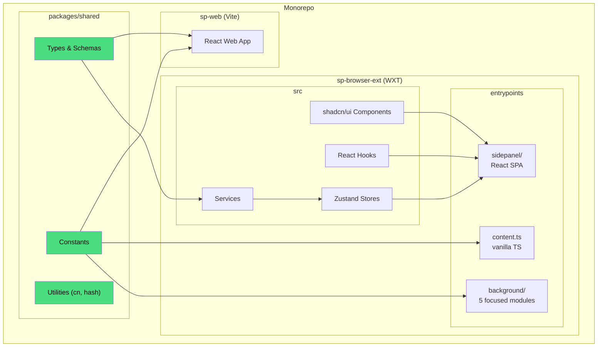
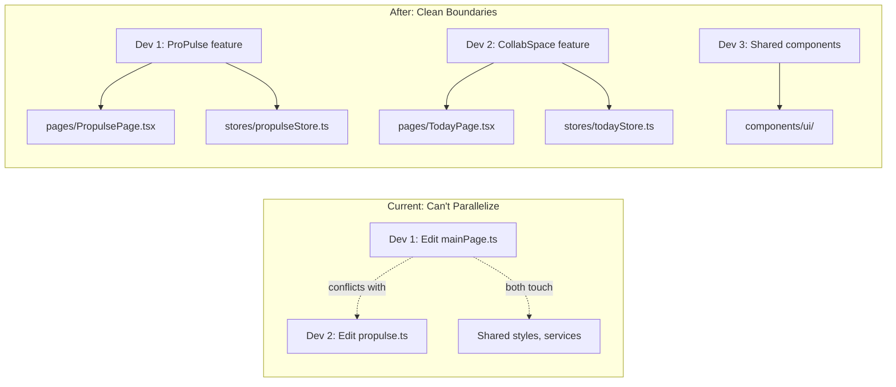

# Extension Migration Plan — Scalability & Maintainability
## From Vanilla TS → WXT + React + Monorepo

> **Last Updated:** 2026-04-28  
> **Status:** Planning — Pre-migration  
> **Related Docs:**  
> - [sp_browser_ext_walkthrough.md](./sp_browser_ext_walkthrough.md) — Current architecture deep-dive  
> - [communication_bridge_analysis.md](./communication_bridge_analysis.md) — Bridge simplification plan  
> - [handler_scalability_analysis.md](./handler_scalability_analysis.md) — Dynamic handler system improvements  

---

## 0. Stack Decision (Verdict)

| Choice | Verdict |
|--------|---------|
| **React** for UI | ✅ **Yes** — enables code sharing with sp-web |
| **WXT** as framework | ✅ **Yes** — replaces Webpack AND webextension-polyfill |
| **Webpack** as bundler | ❌ **Drop** — WXT uses Vite internally |
| **webextension-polyfill** | ❌ **Drop** — WXT provides its own unified `browser` API |
| **Zustand** for state | ✅ **Yes** — 1.2KB, built-in persistence, chrome.storage adapter |
| **shadcn/ui** for components | ✅ **Yes** — same component library as sp-web |
| **Tailwind** for styling | ✅ **Yes** — same config shareable with sp-web |

> [!IMPORTANT]
> **WXT replaces both Webpack and webextension-polyfill.** Adding either alongside WXT is redundant and conflicting. WXT uses Vite under the hood and provides its own cross-browser API wrapper.

---

## 1. Current State Assessment

### 1.1 Codebase Inventory

| Category | Files | Size | Biggest Files (pain points) |
|----------|-------|------|-----------------------------|
| **Background** (service worker) | 5 + handlers | 74KB | `manifest.worker.ts` (46KB god-file) |
| **Content Script** | 2 | 33KB | `content-script.ts` (29KB) |
| **Side Panel Pages** | 15 HTML+TS+CSS sets | ~220KB | `today.ts` (47KB), `add-rating.ts` (37KB) |
| **Services** | 8 singletons | 79KB | `handler-loader.service.ts` (24KB) |
| **Components** | 11 (ui + layout) | 56KB | Imperative class-based DOM |
| **Shared/Lib** | 12 | 54KB | `communication-bridge.ts` (18KB) |
| **Types** | 8+ | 33KB | Well-typed interfaces |
| **Styles** | 15+ CSS files | ~96KB | Per-page, no shared system |
| **Total** | **124 files** | **~949KB** | |

### 1.2 Key Scalability Problems



---

## 2. Target Architecture

### 2.1 Monorepo Structure

The single biggest scalability win is a **monorepo workspace** that shares code between sp-web and sp-browser-ext:

```
SuperPersova/
├── packages/
│   └── shared/                         ← NEW: shared code package
│       ├── package.json
│       ├── src/
│       │   ├── types/                   ← Auth, API, tenant types
│       │   │   ├── auth.ts
│       │   │   ├── tenant.ts
│       │   │   └── api.ts
│       │   ├── schemas/                 ← Zod validation schemas
│       │   │   ├── authSchemas.ts
│       │   │   ├── userSchemas.ts
│       │   │   └── tenantSchemas.ts
│       │   ├── constants/               ← Shared constants
│       │   │   ├── storage-keys.ts      ← from shared-ext-app-constants.ts
│       │   │   ├── api-endpoints.ts     ← from api-config.ts
│       │   │   └── comm-protocol.ts     ← communication types/constants
│       │   ├── utils/                   ← cn(), date helpers, hash
│       │   │   ├── cn.ts
│       │   │   └── hash.ts
│       │   └── index.ts                 ← barrel exports
│       └── tsconfig.json
│
├── sp-web/                              ← existing React web app
│   └── ... (imports from @superpersova/shared)
│
├── sp-browser-ext/                      ← migrated WXT extension
│   ├── wxt.config.ts
│   ├── package.json
│   ├── tailwind.config.ts
│   ├── entrypoints/
│   │   ├── background/                  ← Service Worker modules
│   │   │   ├── index.ts                 ← Entry point
│   │   │   ├── message-router.ts        ← Message dispatch
│   │   │   ├── ai-orchestrator.ts       ← AI queue/poll/retry
│   │   │   ├── tab-manager.ts           ← Tab lifecycle
│   │   │   ├── context-capturer.ts      ← Context extraction
│   │   │   └── handler-injector.ts      ← Dynamic handler injection
│   │   ├── sidepanel/                   ← React SPA (side panel)
│   │   │   ├── index.html
│   │   │   ├── main.tsx
│   │   │   ├── App.tsx                  ← Router + Layout
│   │   │   ├── router.tsx               ← React Router routes
│   │   │   └── pages/
│   │   │       ├── HomePage.tsx
│   │   │       ├── LoginPage.tsx
│   │   │       ├── ProfilePage.tsx
│   │   │       ├── ActivitiesPage.tsx
│   │   │       ├── PropulsePage.tsx
│   │   │       ├── AddRatingPage.tsx
│   │   │       ├── CollabSpacePage.tsx
│   │   │       ├── TodayPage.tsx
│   │   │       ├── BreaksPage.tsx
│   │   │       ├── TruLensPage.tsx
│   │   │       ├── LearningPage.tsx
│   │   │       └── JobsPage.tsx
│   │   ├── content.ts                   ← Content script (vanilla TS)
│   │   └── content-handlers/            ← AI handlers (vanilla TS)
│   │       ├── ai-handler.ts
│   │       ├── chatgpt-handler.ts
│   │       └── perplexity-handler.ts
│   ├── src/
│   │   ├── components/                  ← Extension-specific React components
│   │   │   ├── ui/                      ← shadcn/ui components (shared w/ sp-web)
│   │   │   ├── layout/
│   │   │   │   ├── ExtHeader.tsx
│   │   │   │   ├── ExtSidebar.tsx
│   │   │   │   └── PageShell.tsx
│   │   │   ├── cards/
│   │   │   │   ├── AppCard.tsx
│   │   │   │   └── StatsCard.tsx
│   │   │   └── feedback/
│   │   │       ├── RatingStars.tsx
│   │   │       └── FactorBadge.tsx
│   │   ├── hooks/                       ← React hooks (real hooks now!)
│   │   │   ├── useAuth.ts               ← Auth state + storage sync
│   │   │   ├── useExtensionStorage.ts   ← WXT storage wrapper
│   │   │   ├── useBrowserApi.ts         ← Chrome API utilities
│   │   │   ├── useCurrentTab.ts         ← Active tab info
│   │   │   └── useAiProvider.ts         ← AI provider state
│   │   ├── stores/                      ← Zustand stores (lightweight)
│   │   │   ├── authStore.ts
│   │   │   ├── appStore.ts
│   │   │   └── aiStore.ts
│   │   ├── services/                    ← API service layer
│   │   │   ├── api.ts                   ← Shared fetch wrapper
│   │   │   ├── auth.service.ts          ← Uses shared schemas
│   │   │   ├── propulse.service.ts
│   │   │   └── activity.service.ts
│   │   ├── lib/                         ← Extension-specific utilities
│   │   │   ├── communication-bridge.ts
│   │   │   └── storage-adapter.ts
│   │   └── styles/
│   │       └── globals.css              ← Single Tailwind entry
│   └── assets/
│       └── icons/
│
├── sp-api/                              ← existing API
├── package.json                         ← workspace root
├── pnpm-workspace.yaml                  ← monorepo config
└── turbo.json                           ← (optional) Turborepo
```

### 2.2 Architecture Diagram



---

## 3. Design Decisions for Scalability

### 3.1 State Management: Zustand (not Redux)

| Criterion | Redux (sp-web uses this) | Zustand (recommended for ext) |
|-----------|-------------------------|------------------------------|
| Bundle size | ~11KB | ~1.2KB |
| Boilerplate | High (slices, actions, reducers) | Minimal (single store object) |
| Side panel constraint | Overkill for extension UI | Perfect fit |
| DevTools | ✅ | ✅ (via middleware) |
| Persistence | Manual | Built-in `persist` middleware |
| Extension storage sync | Manual | Custom `chromeStorage` adapter |

```typescript
// stores/authStore.ts — Zustand with chrome.storage persistence
import { create } from 'zustand';
import { persist } from 'zustand/middleware';
import { chromeStorageAdapter } from '@/lib/storage-adapter';

interface AuthState {
  token: string | null;
  user: AuthUser | null;
  tenantId: string | null;
  isAuthenticated: boolean;
  login: (token: string, user: AuthUser) => void;
  logout: () => void;
}

export const useAuthStore = create<AuthState>()(
  persist(
    (set) => ({
      token: null,
      user: null,
      tenantId: null,
      isAuthenticated: false,
      login: (token, user) => set({ token, user, isAuthenticated: true }),
      logout: () => set({ token: null, user: null, tenantId: null, isAuthenticated: false }),
    }),
    {
      name: 'sp-auth',
      storage: chromeStorageAdapter, // Uses WXT storage under the hood
    }
  )
);
```

> [!TIP]
> Zustand stores can be consumed in both the side panel React app AND the background service worker. Same store, same state shape — no more manual syncing between `storageService` and UI state.

### 3.2 Service Worker: Modular, Not Monolithic

The current 46KB `manifest.worker.ts` should split into **5 focused modules**:

| Module | Current Lines | Responsibility |
|--------|--------------|----------------|
| `index.ts` | ~50 | Entry point, lifecycle events (install/activate) |
| `message-router.ts` | ~80 | `onMessage` dispatcher → routes to handlers |
| `ai-orchestrator.ts` | ~300 | Full AI queue/poll/retry/tab management |
| `context-capturer.ts` | ~60 | Context extraction + IndexedDB save |
| `handler-injector.ts` | ~150 | Dynamic handler injection + tab tracking |
| `tab-manager.ts` | ~60 | Tab lifecycle (onUpdated, onRemoved) |

```typescript
// entrypoints/background/index.ts
import { setupMessageRouter } from './message-router';
import { setupTabManager } from './tab-manager';
import { setupAIOrchestrator } from './ai-orchestrator';
import { preloadHandlers, clearExpiredCaches } from './handler-injector';

export default defineBackground(() => {
  console.log('SuperPersova service worker starting...');
  
  setupMessageRouter();
  setupTabManager();
  setupAIOrchestrator();
  
  // Lifecycle
  self.addEventListener('activate', () => {
    preloadHandlers();
    clearExpiredCaches();
  });
});
```

### 3.3 Content Script: Stay Vanilla

```typescript
// entrypoints/content.ts
export default defineContentScript({
  matches: ['<all_urls>'],
  runAt: 'document_idle',
  main(ctx) {
    // Import the current content-script.ts logic
    // NO React here — too heavy for every page
    initHoverDetection();
    initSelectionDetection();
    initCommunicationBridge();
  },
});
```

### 3.4 Side Panel: React SPA with Router

```typescript
// entrypoints/sidepanel/App.tsx
import { BrowserRouter, Routes, Route, Navigate } from 'react-router-dom';
import { useAuthStore } from '@/stores/authStore';
import { PageShell } from '@/components/layout/PageShell';

function ProtectedRoute({ children }: { children: React.ReactNode }) {
  const isAuth = useAuthStore((s) => s.isAuthenticated);
  return isAuth ? <>{children}</> : <Navigate to="/login" />;
}

export default function App() {
  return (
    <BrowserRouter>
      <Routes>
        <Route path="/login" element={<LoginPage />} />
        <Route element={<ProtectedRoute><PageShell /></ProtectedRoute>}>
          <Route index element={<HomePage />} />
          <Route path="activities" element={<ActivitiesPage />} />
          <Route path="propulse" element={<PropulsePage />} />
          <Route path="propulse/add-rating" element={<AddRatingPage />} />
          <Route path="collabspace" element={<CollabSpacePage />} />
          <Route path="collabspace/today" element={<TodayPage />} />
          <Route path="collabspace/breaks" element={<BreaksPage />} />
          <Route path="trulens" element={<TruLensPage />} />
          <Route path="learning" element={<LearningPage />} />
          <Route path="jobs" element={<JobsPage />} />
          <Route path="profile" element={<ProfilePage />} />
          <Route path="ai-setup" element={<AISetupPage />} />
        </Route>
      </Routes>
    </BrowserRouter>
  );
}
```

### 3.5 API Service: Composable, Not Singleton

Replace the god-singleton `ApiService` with a composable pattern:

```typescript
// services/api.ts
import { useAuthStore } from '@/stores/authStore';

const BASE_URL = import.meta.env.VITE_API_URL; // WXT env variable

async function request<T>(endpoint: string, options: RequestInit = {}): Promise<T> {
  const { token, tenantId } = useAuthStore.getState();
  
  const headers = new Headers({
    'Content-Type': 'application/json',
    ...(token && { Authorization: `Bearer ${token}` }),
    ...(tenantId && { 'x-tenant-id': tenantId }),
    ...options.headers,
  });

  const response = await fetch(`${BASE_URL}${endpoint}`, { ...options, headers });
  
  if (response.status === 401) {
    // Token refresh logic
    const newToken = await refreshToken();
    if (newToken) {
      headers.set('Authorization', `Bearer ${newToken}`);
      return fetch(`${BASE_URL}${endpoint}`, { ...options, headers }).then(r => r.json());
    }
    throw new Error('Authentication required');
  }
  
  if (!response.ok) throw new Error(`API ${response.status}: ${response.statusText}`);
  return response.json();
}

export const api = {
  get: <T>(url: string) => request<T>(url),
  post: <T>(url: string, body: unknown) => request<T>(url, { method: 'POST', body: JSON.stringify(body) }),
  put: <T>(url: string, body: unknown) => request<T>(url, { method: 'PUT', body: JSON.stringify(body) }),
  delete: <T>(url: string) => request<T>(url, { method: 'DELETE' }),
};
```

### 3.6 Storage: Domain-Separated, Not Monolithic

The current `StorageService` (378 lines) mixes generic CRUD with domain logic (breaks, today, AI). Split it:

| Current (mixed) | Proposed (separated) |
|-----------------|---------------------|
| `storageService.getDayBreaks()` | `breaksStore.ts` (Zustand + persist) |
| `storageService.saveTodayPlan()` | `todayStore.ts` (Zustand + persist) |
| `storageService.getAIProvider()` | `aiStore.ts` (Zustand + persist) |
| `storageService.get/set/remove()` | WXT's built-in `storage.defineItem()` |

```typescript
// WXT's built-in typed storage
import { storage } from 'wxt/storage';

// Define typed storage items
export const accessToken = storage.defineItem<string>('local:accessToken');
export const selectedTenant = storage.defineItem<Tenant>('local:selectedTenant');

// Usage: no StorageService needed
const token = await accessToken.getValue();
await accessToken.setValue('new-token');
```

---

## 4. Shared Package Design (`@superpersova/shared`)

### 4.1 What Goes in Shared

| Source (current location) | Shared Package Path | Used By |
|--------------------------|--------------------| --------|
| `shared-ext-app-constants.ts` (STORAGE_KEYS, COMM_*) | `constants/storage-keys.ts`, `constants/comm-protocol.ts` | ext + web |
| `api-config.ts` (API_ENDPOINTS) | `constants/api-endpoints.ts` | ext + web |
| sp-web `shared/lib/validation/*.ts` (Zod schemas) | `schemas/*.ts` | ext + web |
| sp-web auth types + ext auth types | `types/auth.ts` | ext + web |
| `cn()` utility | `utils/cn.ts` | ext + web |
| `hashService.doubleHasherWithNonce` | `utils/hash.ts` | ext + web |

### 4.2 What Stays Extension-Only

| File | Why it's extension-specific |
|------|-----------------------------|
| `communication-bridge.ts` | Uses `window.postMessage` + `chrome.storage` |
| `handler-loader.service.ts` | Uses `chrome.scripting.executeScript` |
| `context-extractor.ts` | Uses `chrome.tabs`, `chrome.scripting` |
| Content script overlay CSS | Injected into page DOM |
| All background handler code | Chrome-specific execution model |

### 4.3 Monorepo Setup

```yaml
# pnpm-workspace.yaml
packages:
  - 'packages/*'
  - 'sp-web'
  - 'sp-browser-ext'
  - 'sp-api'
```

```jsonc
// packages/shared/package.json
{
  "name": "@superpersova/shared",
  "version": "0.1.0",
  "type": "module",
  "main": "./src/index.ts",
  "types": "./src/index.ts",
  "exports": {
    ".": "./src/index.ts",
    "./schemas": "./src/schemas/index.ts",
    "./types": "./src/types/index.ts",
    "./constants": "./src/constants/index.ts",
    "./utils": "./src/utils/index.ts"
  },
  "dependencies": {
    "zod": "^3.x",
    "clsx": "^2.x",
    "tailwind-merge": "^2.x"
  }
}
```

---

## 5. Migration Strategy (Phased)

### Phase 0: Monorepo Foundation (1 day)

```
Goal: Set up workspace without changing any existing code
```

- Add `pnpm-workspace.yaml` to SuperPersova root
- Create `packages/shared/` with initial barrel exports
- Extract `shared-ext-app-constants.ts` → `packages/shared/src/constants/`
- Both sp-web and sp-browser-ext import from `@superpersova/shared`
- **Both projects keep working** — this is additive only

### Phase 1: WXT Scaffold (1-2 days)

```
Goal: New WXT project running alongside old code
```

- `npx wxt@latest init sp-browser-ext-v2 --template react`
- Add Tailwind, shadcn/ui components
- Configure `wxt.config.ts` with permissions, manifest settings
- Port the **Login page** first (simplest, proves the stack works)
- Verify: extension loads in browser, login flow works

### Phase 2: Service Worker Decomposition (2-3 days)

```
Goal: Background logic ported and modularized
```

- Split `manifest.worker.ts` into 5 modules
- Port AI orchestration (queue, poll, retry) → `ai-orchestrator.ts`
- Port handler injection → `handler-injector.ts`
- Port message routing → `message-router.ts`
- **This is the riskiest phase** — thorough testing needed
- Content script ports with minimal changes (already vanilla TS)

### Phase 3: Side Panel Pages (3-5 days)

```
Goal: All 15 pages ported to React SPA
```

Port order (simplest → most complex):

| Priority | Page | Current Size | Complexity |
|----------|------|-------------|------------|
| 1 | Login | 6KB TS | Low — simple form |
| 2 | Main (Home) | 15KB TS | Low — card grid + nav |
| 3 | Profile | ~8KB TS | Low — display + form |
| 4 | AI Setup | ~5KB TS | Low — settings form |
| 5 | Job Placement | 1KB TS | Very low — placeholder |
| 6 | Learning & Skills | 9KB TS | Medium — list + details |
| 7 | TruLens | 9KB TS | Medium — activity list |
| 8 | Activities | 9KB TS | Medium — list + run |
| 9 | CollabSpace | 1KB TS | Low — hub page |
| 10 | Breaks | 11KB TS | Medium — timer + history |
| 11 | Propulse | 18KB TS | High — ratings dashboard |
| 12 | Ratings Timeline | ~15KB TS | High — timeline + data |
| 13 | Partner Timeline | ~10KB TS | Medium — partner cards |
| 14 | Add Rating | 37KB TS | **Very high** — multi-step form |
| 15 | Today Planner | 47KB TS | **Very high** — drag, timer, state |

### Phase 4: Component Library (2-3 days)

```
Goal: Shared component library between ext and web
```

- Install shadcn/ui in extension project
- Port shared components: Button, Card, Badge, Input, Modal, Toast
- Create extension-specific: `AppCard`, `StatsCard`, `PageShell`
- Share Tailwind config (colors, fonts, spacing) with sp-web

### Phase 5: Polish & Testing (2-3 days)

```
Goal: Production-ready with tests
```

- Vitest unit tests for services and stores
- Playwright E2E tests for critical flows (login → navigate → action)
- Production build optimization (analyze bundle size)
- Cross-browser testing (Chrome, Edge, Firefox)

---

## 6. Scalability Comparison

### Before vs After

| Dimension | Before (current) | After (WXT + React) |
|-----------|-----------------|-------------------|
| **Add a new feature page** | Create HTML + TS + CSS, wire navigation manually | Create single `.tsx` file, add route |
| **Share code with sp-web** | Copy-paste files between repos | `import { X } from '@superpersova/shared'` |
| **Add a new UI component** | Write imperative DOM class (100+ lines) | Install shadcn/ui or write React component (30 lines) |
| **Change navigation** | Edit `window.location.href` in 5+ places | Change one route in `router.tsx` |
| **Share state between pages** | Can't — each page is fresh JS context | Zustand store persists across navigations |
| **Test a service** | No test infrastructure | Vitest + mock chrome APIs |
| **Bundle for production** | Raw TS compile, no optimization | Vite minification + tree-shaking |
| **Dev cycle** | Edit → `npm run build:dev` → refresh browser | Edit → HMR instant update |
| **Add new developer** | Learn custom component system + file conventions | Standard React + Tailwind + shadcn |

### Team Scaling Impact



---

## 7. Risk Mitigation

| Risk | Mitigation |
|------|------------|
| AI orchestration breaks during port | Port service worker modules first, test with existing content script before touching UI |
| Content script conflicts | Keep vanilla TS — don't React-ify. WXT handles injection lifecycle automatically |
| Side panel memory usage | React + Zustand in extension panel is ~50KB total — well within limits. Lazy-load heavy pages |
| Lost extension state during navigation | Zustand `persist` + `chromeStorage` adapter. State survives page reloads (which won't happen in SPA anyway) |
| Communication bridge breaks | Port last — it uses standard `window.postMessage`, not extension-specific APIs |
| Today planner (47KB) is too complex to port | Break into sub-components: `TimeBlock`, `TaskList`, `DragDropProvider`, `TimerWidget` — each testable independently |

---

## 8. Estimated Timeline

| Phase | Duration | Deliverable |
|-------|----------|------------|
| Phase 0: Monorepo | 1 day | `@superpersova/shared` package, both projects import it |
| Phase 1: WXT Scaffold | 1-2 days | Extension loads, login works |
| Phase 2: Service Worker | 2-3 days | Background fully ported + modularized |
| Phase 3: Side Panel Pages | 3-5 days | All 15 pages as React SPA |
| Phase 4: Component Library | 2-3 days | Shared shadcn/ui components |
| Phase 5: Polish | 2-3 days | Tests, optimization, cross-browser |
| **Total** | **~2-3 weeks** | Production-ready WXT + React extension |

> [!NOTE]
> This is a **full rewrite**, not an incremental migration. The monorepo foundation (Phase 0) is the only phase that touches existing code. Phases 1-5 build the new project in parallel, and you switch over when ready.

---

## Changelog

| Date | Change |
|------|--------|
| 2026-04-28 | Initial plan created. Merged stack verdict from migration analysis. Added cross-references to related docs. |
