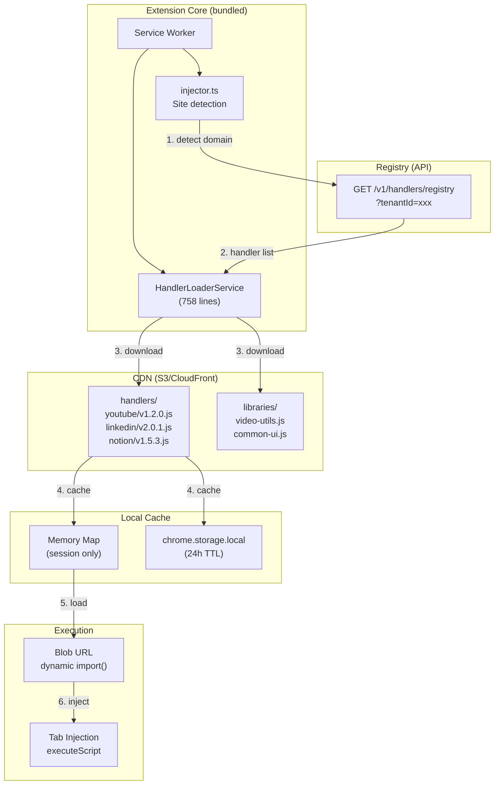

# Dynamic Handler Architecture — Scalability Analysis

> **Last Updated:** 2026-04-28  
> **Status:** Analysis complete — 4 critical fixes identified, 8 scalability suggestions  
> **Related Docs:**  
> - [extension_migration_plan.md](./extension_migration_plan.md) — WXT + React migration plan  
> - [sp_browser_ext_walkthrough.md](./sp_browser_ext_walkthrough.md) — Current architecture  
> - [communication_bridge_analysis.md](./communication_bridge_analysis.md) — Bridge simplification  
> **Source Code:**  
> - [handler-loader.service.ts](../../src/services/handler-loader.service.ts) — 758 lines  
> - [injector.ts](../../src/background/injector.ts) — 288 lines  
> - [handler-registry.ts](../../src/types/handler-registry.ts) — Types  

---

## 1. Current State: What You Have

Your handler architecture is genuinely well-designed. It's a **plugin system** with remote code loading — the same pattern used by Figma, VS Code extensions, and Shopify's app ecosystem.

### Architecture Summary



### What's Working Well

| Feature | Implementation | Rating |
|---------|---------------|--------|
| **4-level fallback** | Memory → Storage → CDN → Local | ✅ Excellent |
| **Tenant isolation** | Registry scoped by tenantId | ✅ Solid |
| **Stateless handlers** | ExecutionContext injected, no internal state | ✅ Clean |
| **Cache with TTL** | 24h handlers, 7d libraries, auto-cleanup | ✅ Good |
| **CSP-safe injection** | `executeScript({ files: [] })` first, code fallback | ✅ Smart |
| **Hot updates** | Upload to CDN → cache expires → new version loads | ✅ Core benefit |
| **Shared libraries** | Dependencies loaded first, deduped | ✅ Good design |
| **Parallel preload** | `Promise.all(registry.handlers.map(...))` | ✅ Fast |

### Current Handler Inventory

| Handler | Location | Type | Purpose |
|---------|----------|------|---------|
| `ai` | `handlers/ai/` | Default (injected on all pages) | AI assistance relay |
| `chatgpt` | `handlers/chatgpt/` | AI Provider | ChatGPT tab orchestration |
| `perplexity` | `handlers/perplexity/` | AI Provider | Perplexity tab orchestration |
| `superpersova` | `handlers/superpersova/` | Site-specific | Auth sync, UI injection on SP web app |
| `default` | `handlers/default/` | Fallback | Basic context extraction for all sites |

---

## 2. Issues to Fix Now

### 🔴 Issue 1: Checksum Verification Not Enforced

Your docs mention it, your types have `checksum?: string`, but the actual `downloadHandler()` and `getHandlerCode()` methods **never verify it**:

```typescript
// handler-loader.service.ts — downloadHandler() does NOT verify checksum
const scriptCode = await this.fetchScript(metadata.scriptUrl);
// ❌ Missing: verify SHA-256 checksum before caching
```

**Risk**: If your CDN is compromised or a MITM attack occurs, arbitrary code executes in users' browsers.

**Fix**:
```typescript
async downloadHandler(metadata: HandlerMetadata): Promise<CachedHandler> {
  const scriptCode = await this.fetchScript(metadata.scriptUrl);
  
  // Enforce checksum if provided
  if (metadata.checksum) {
    const hash = await crypto.subtle.digest('SHA-256', new TextEncoder().encode(scriptCode));
    const hashHex = Array.from(new Uint8Array(hash)).map(b => b.toString(16).padStart(2, '0')).join('');
    if (`sha256:${hashHex}` !== metadata.checksum) {
      throw new Error(`Checksum mismatch for handler ${metadata.id}`);
    }
  }
  // ...
}
```

### 🔴 Issue 2: Blob URL Memory Leak

In `loadHandler()`, blob URLs are created but **never revoked**:

```typescript
const blob = new Blob([cached.scriptCode], { type: 'text/javascript' });
const blobUrl = URL.createObjectURL(blob);
// ❌ URL.revokeObjectURL(blobUrl) is never called
```

Even `clearLoadedHandlers()` has a comment admitting it:
```typescript
// Note: We can't revoke blob URLs here as we don't store them
```

**Fix**: Store blob URLs alongside loaded handlers:
```typescript
private blobUrls: Map<string, string> = new Map(); // handlerId → blobUrl

async loadHandler(handlerId: string): Promise<SiteHandler> {
  // ...create blobUrl...
  this.blobUrls.set(handlerId, blobUrl);
  // ...
}

clearLoadedHandlers(): void {
  // Revoke all blob URLs
  this.blobUrls.forEach(url => URL.revokeObjectURL(url));
  this.blobUrls.clear();
  // ...existing cleanup...
}
```

### 🟡 Issue 3: Duplicate Cache Prefix Constants

`HANDLER_CACHE_PREFIX` is defined in **two places**:
1. `types/handler-registry.ts` line 198: `export const HANDLER_CACHE_PREFIX = 'handler_cache_';`
2. `handler-loader.service.ts` line 641: `private static readonly HANDLER_CACHE_PREFIX = 'sp_handler_';`

They have **different values** (`handler_cache_` vs `sp_handler_`). The first is used by `downloadHandler()` / `getCachedHandler()` / `clearExpiredCaches()`. The second is used by `getHandlerCode()` / `cacheHandler()`. This means two separate caching systems exist in the same class.

**Fix**: Consolidate to one prefix, one caching path.

### 🟡 Issue 4: Registry Fetch Has No Auth Headers

```typescript
const response = await fetch(`${this.registryApiUrl}/handlers?tenantId=${tenantId}`, {
  headers: { 'Content-Type': 'application/json' }
});
// ❌ Missing: Authorization: Bearer <token>
```

Any handler registry is accessible without authentication. If you add tenant-specific handlers with sensitive integrations, this is a security gap.

---

## 3. Scalability Suggestions

### Suggestion 1: Handler SDK with Versioned API Contract

**Problem**: Currently, handlers import from `@superpersova/constants` and receive an untyped `executionContext`. If you change the extension's API surface, old handlers break silently.

**Solution**: Create a versioned **Handler SDK** that handlers import:

```typescript
// @superpersova/handler-sdk (published to CDN or npm)
export interface HandlerSDK {
  // Versioned API contract
  readonly version: '2.0';
  
  // Storage (scoped to this handler's namespace)
  storage: {
    get<T>(key: string): Promise<T | null>;
    set<T>(key: string, value: T): Promise<void>;
    // Handler can only access its own keys
  };
  
  // Extension APIs
  api: {
    captureContext(data: ContextData): Promise<void>;
    openSidePanel(page?: string): Promise<void>;
    showNotification(msg: string): void;
    getActiveTab(): Promise<TabInfo>;
  };
  
  // UI injection (safe, scoped)
  ui: {
    injectCSS(css: string): void;
    createOverlay(config: OverlayConfig): HTMLElement;
    showToast(message: string, type: 'info' | 'success' | 'error'): void;
  };
  
  // Handler identity
  handlerId: string;
  tenantId: string;
  url: string;
}

// Handler implements this interface
export interface HandlerModule {
  // Required metadata
  readonly id: string;
  readonly version: string;
  readonly apiVersion: '2.0';  // ← declares required SDK version
  
  // Lifecycle hooks
  onInstall?(sdk: HandlerSDK): Promise<void>;
  onActivate?(sdk: HandlerSDK): Promise<void>;
  onDeactivate?(sdk: HandlerSDK): Promise<void>;
  
  // Core methods
  enhanceContext?(context: PageContext, sdk: HandlerSDK): Promise<PageContext>;
  extractMetadata?(sdk: HandlerSDK): Promise<Record<string, any>>;
  handleMessage?(message: any, sdk: HandlerSDK): Promise<any>;
}
```

The extension then checks `handler.apiVersion` before loading:
```typescript
if (handler.apiVersion !== CURRENT_SDK_VERSION) {
  console.warn(`Handler ${handler.id} requires SDK v${handler.apiVersion}, current is v${CURRENT_SDK_VERSION}`);
  // Graceful fallback or compatibility layer
}
```

### Suggestion 2: Server-Push Version Updates

**Problem**: Handlers update only when cache expires (24h). If you deploy a critical fix, users wait up to 24 hours.

**Solution**: Two options:

**Option A — Push via registry polling (simple)**:
```typescript
// Poll registry every 30 minutes (lightweight — just version numbers)
chrome.alarms.create('checkHandlerUpdates', { periodInMinutes: 30 });

chrome.alarms.onAlarm.addListener(async (alarm) => {
  if (alarm.name === 'checkHandlerUpdates') {
    const registry = await fetchHandlerRegistry(tenantId);
    
    for (const handler of registry.handlers) {
      const cached = await getCachedHandler(handler.id);
      if (cached && cached.metadata.version !== handler.version) {
        console.log(`[HandlerLoader] New version available: ${handler.id} ${cached.metadata.version} → ${handler.version}`);
        await refreshHandler(handler.id, handler);
      }
    }
  }
});
```

**Option B — Push notification via WebSocket (advanced)**:
```typescript
// Backend pushes update notification
// Extension listens on a lightweight WebSocket/SSE
const updates = new EventSource(`${API_URL}/handlers/updates?tenantId=${tenantId}`);
updates.onmessage = (event) => {
  const { handlerId, newVersion } = JSON.parse(event.data);
  invalidateHandler(handlerId); // Forces re-download on next use
};
```

### Suggestion 3: Delta / Incremental Updates

**Problem**: When a handler updates from v1.2.0 → v1.2.1 (one-line fix), the entire script re-downloads.

**Solution**: Support **patches** in the registry:

```jsonc
{
  "id": "youtube-v1.2.1",
  "version": "1.2.1",
  "scriptUrl": "https://cdn.superpersova.com/handlers/youtube/v1.2.1.js",
  // NEW: patch from previous version
  "patch": {
    "fromVersion": "1.2.0",
    "patchUrl": "https://cdn.superpersova.com/handlers/youtube/v1.2.0-to-v1.2.1.patch",
    "patchSize": 256  // bytes — vs 30KB full download
  }
}
```

> [!TIP]
> Only implement this when you have handlers > 100KB. For 10-50KB handlers, full re-download is fast enough. This is a "Phase 3" optimization.

### Suggestion 4: Handler Capability Matrix + Feature Flags

**Problem**: Right now, capabilities are boolean (`enhanceContext: true/false`). As you add more features (AI assistance, UI injection, data collection), you need finer control.

**Solution**: Capabilities as a versioned matrix with tenant-level feature flags:

```typescript
interface HandlerCapabilities {
  // Core capabilities (handler declares what it CAN do)
  enhanceContext: boolean;
  extractMetadata: boolean;
  injectUI: boolean;
  handleMessages: boolean;
  
  // Feature flags (backend controls what it's ALLOWED to do for this tenant)
  features: {
    aiAssist: boolean;         // Can use AI relay
    dataCapture: boolean;      // Can capture page data
    uiOverlay: boolean;        // Can inject UI overlay
    crossSiteSync: boolean;    // Can sync data across sites
    offlineMode: boolean;      // Works without network
  };
  
  // Permissions (what browser APIs the handler needs)
  permissions: ('tabs' | 'storage' | 'scripting' | 'sidePanel')[];
  
  // Resource limits
  limits: {
    maxStorageBytes: number;    // e.g., 5MB per handler
    maxApiCallsPerMinute: number;
    maxDomMutations: number;    // Prevent page jank
  };
}
```

### Suggestion 5: Handler Health Monitoring

**Problem**: Handler errors are `console.error`-ed and swallowed. You have no visibility into which handlers fail, how often, or why.

**Solution**: Structured telemetry:

```typescript
interface HandlerTelemetry {
  handlerId: string;
  version: string;
  tenantId: string;
  event: 'load' | 'execute' | 'error' | 'timeout' | 'cache_hit' | 'cache_miss';
  duration?: number;        // ms
  error?: string;
  url?: string;             // Which site triggered it
  timestamp: number;
}

// Collect in extension, batch-send to analytics endpoint
class HandlerMetrics {
  private buffer: HandlerTelemetry[] = [];
  private flushInterval = 5 * 60 * 1000; // 5 min

  track(event: HandlerTelemetry) {
    this.buffer.push(event);
    if (this.buffer.length >= 50) this.flush();
  }

  async flush() {
    if (this.buffer.length === 0) return;
    const batch = [...this.buffer];
    this.buffer = [];
    await fetch(`${API_URL}/handlers/telemetry`, {
      method: 'POST',
      body: JSON.stringify(batch),
    }).catch(() => {
      // Re-queue on failure
      this.buffer.unshift(...batch);
    });
  }
}
```

This gives you a **dashboard** showing:
- Load times per handler per region
- Error rates with error budgets
- Cache hit/miss ratios
- Most/least used handlers
- Version adoption (how fast users get new versions)

### Suggestion 6: Handler Composition (Chain Multiple Handlers)

**Problem**: Current architecture is 1 handler per domain. What if you want both a "YouTube" handler AND a general "AI Assist" handler on the same page?

**Solution**: Handler pipeline / composition:

```typescript
// Multiple handlers can match a domain, executed in priority order
interface HandlerMetadata {
  // ...existing fields...
  priority: number;        // Lower = runs first (0 = highest priority)
  composable: boolean;     // Can run alongside other handlers
  exclusive: boolean;      // If true, no other handlers run after this
}

// Execution:
async function executeHandlerPipeline(url: string, context: PageContext): Promise<PageContext> {
  const matchingHandlers = registry.handlers
    .filter(h => h.domains.some(d => url.includes(d)))
    .sort((a, b) => a.priority - b.priority);
  
  let enrichedContext = context;
  for (const handlerMeta of matchingHandlers) {
    const handler = await loadHandler(handlerMeta.id);
    if (handler.enhanceContext) {
      enrichedContext = await handler.enhanceContext(enrichedContext, sdk);
    }
    if (handlerMeta.exclusive) break;
  }
  return enrichedContext;
}
```

### Suggestion 7: Handler Sandbox / Isolation

**Problem**: Dynamically loaded code from CDN has full access to the extension's chrome APIs via the execution context. A malicious or buggy handler could read all storage, send messages, etc.

**Solution**: Scope the execution context:

```typescript
function createScopedSDK(handlerId: string, tenantId: string): HandlerSDK {
  return {
    storage: {
      // Namespace all keys to this handler
      async get<T>(key: string) {
        return storageService.get<T>(`handler:${handlerId}:${key}`);
      },
      async set<T>(key: string, value: T) {
        const fullKey = `handler:${handlerId}:${key}`;
        // Enforce storage quota per handler
        const currentUsage = await getHandlerStorageUsage(handlerId);
        if (currentUsage > MAX_HANDLER_STORAGE) {
          throw new Error(`Storage quota exceeded for handler ${handlerId}`);
        }
        return storageService.set(fullKey, value);
      },
    },
    api: {
      // Rate-limit API calls
      captureContext: rateLimited(captureContext, { max: 10, windowMs: 60000 }),
      openSidePanel: rateLimited(openSidePanel, { max: 5, windowMs: 60000 }),
    },
  };
}
```

### Suggestion 8: Offline-First with Cache API

**Problem**: If the user is offline and cache has expired, handlers fail entirely.

**Solution**: Use the **Cache API** (available in service workers) alongside `chrome.storage.local`:

```typescript
// Cache API provides HTTP-level caching with better semantics
const HANDLER_CACHE_NAME = 'sp-handler-cache-v1';

async function fetchWithCache(url: string): Promise<string> {
  const cache = await caches.open(HANDLER_CACHE_NAME);
  
  try {
    // Try network first
    const networkResponse = await fetch(url);
    if (networkResponse.ok) {
      cache.put(url, networkResponse.clone());
      return networkResponse.text();
    }
  } catch {
    // Network failed
  }
  
  // Fallback to cache (works offline, even if "expired")
  const cachedResponse = await cache.match(url);
  if (cachedResponse) {
    console.warn('[HandlerLoader] Using offline cache for:', url);
    return cachedResponse.text();
  }
  
  throw new Error(`Handler unavailable offline: ${url}`);
}
```

---

## 4. How This Maps to WXT Migration

The handler system is **mostly UI-agnostic** — it runs in the service worker. Here's what changes:

| Component | Current | With WXT | Change? |
|-----------|---------|----------|---------|
| `HandlerLoaderService` (758 lines) | Singleton class | Same class, in `entrypoints/background/` | ⚪ Minimal — import paths change |
| `injector.ts` (288 lines) | Direct `import()` | Same, Vite bundles it | ⚪ Minimal |
| Handler types (`handler-registry.ts`) | Extension-only types | Move to `@superpersova/shared` | 🟢 Better — backend can import same types |
| Cache management | `chrome.storage.local` | WXT `storage.defineItem()` OR keep raw | 🟡 Optional |
| CDN handler execution | Blob URL + `import()` | Same mechanism | ⚪ No change |
| `executeScript` injection | `chrome.scripting.executeScript` | `browser.scripting.executeScript` | ⚪ Namespace only |
| Handler SDK | Doesn't exist yet | Build in `@superpersova/shared/handler-sdk` | 🟢 New |

> [!IMPORTANT]
> The handler system is the **least affected** part of the WXT migration. It runs entirely in the service worker with no UI dependencies. Focus on the side panel SPA migration first; the handler system can migrate last with minimal changes.

---

## 5. Priority Order

| Priority | Suggestion | Effort | Impact |
|----------|-----------|--------|--------|
| 🔴 **Now** | Fix checksum verification | 1 hour | Security |
| 🔴 **Now** | Fix blob URL memory leak | 30 min | Stability |
| 🔴 **Now** | Consolidate cache prefixes | 30 min | Bug fix |
| 🟡 **Soon** | Add auth headers to registry fetch | 30 min | Security |
| 🟡 **Soon** | Handler version polling (Suggestion 2A) | 2 hours | Freshness |
| 🟡 **Soon** | Handler health telemetry (Suggestion 5) | 1 day | Observability |
| 🟢 **Phase 2** | Handler SDK with versioned contract (Suggestion 1) | 2-3 days | Scalability |
| 🟢 **Phase 2** | Handler sandbox/scoping (Suggestion 7) | 1-2 days | Security |
| 🟢 **Phase 2** | Handler composition (Suggestion 6) | 1 day | Flexibility |
| 🔵 **Future** | Delta updates (Suggestion 3) | 2-3 days | Performance |
| 🔵 **Future** | Capability matrix (Suggestion 4) | 1 day | Governance |
| 🔵 **Future** | Offline-first Cache API (Suggestion 8) | 1 day | Reliability |
