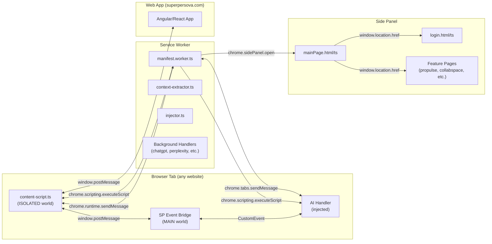
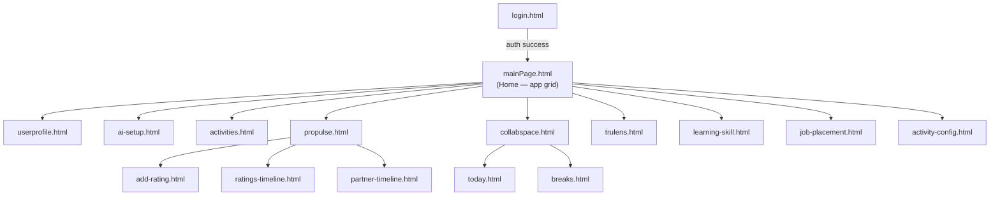
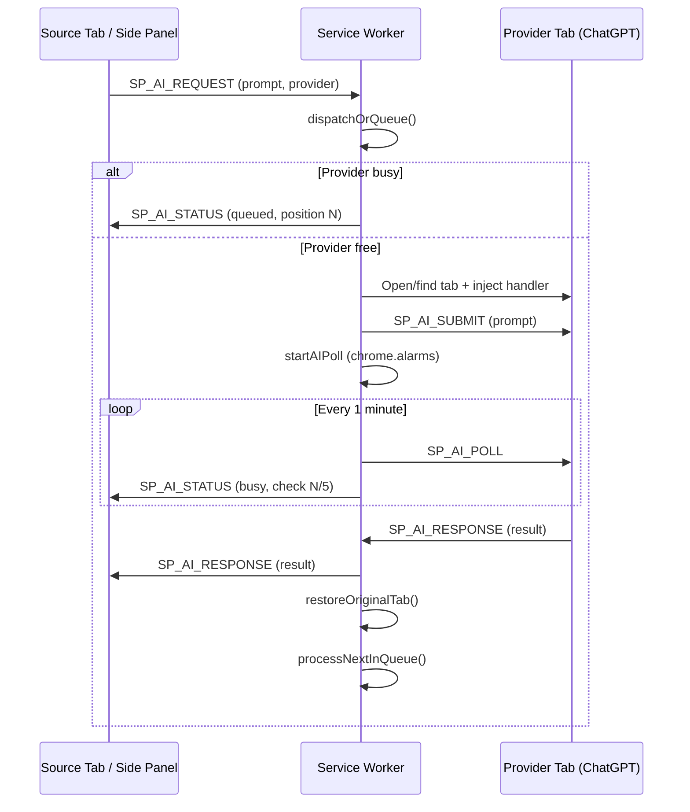

# sp-browser-ext Architecture Walkthrough
## Vanilla JS/TS + HTML + CSS — Chrome MV3 Extension

> **Last Updated:** 2026-04-28  
> **Status:** Current architecture (pre-WXT migration)  
> **Related Docs:**  
> - [extension_migration_plan.md](./extension_migration_plan.md) — WXT + React migration plan  
> - [communication_bridge_analysis.md](./communication_bridge_analysis.md) — Bridge simplification  
> - [handler_scalability_analysis.md](./handler_scalability_analysis.md) — Handler system improvements  

---

## 1. What Is This?

A **Manifest V3 Chrome/Edge side-panel extension** built with **TypeScript compiled to plain JS** — no React, no bundlers. Each page is a standalone HTML file with its own CSS and TS script. The extension:

- Captures context from web pages (images, text, video, audio)
- Opens a **side panel** with feature apps (Activities, ProPulse, CollabSpace, TruLens, etc.)
- Communicates bidirectionally with the SuperPersova web app via `window.postMessage`
- Orchestrates **AI provider tabs** (ChatGPT, Perplexity) with request queuing and retry logic
- Dynamically injects site-specific **handlers** from a CDN or local bundle

---

## 2. Project Structure

```
sp-browser-ext/
├── manifests/                    # Per-environment manifest.json files
│   ├── manifest.dev.json
│   ├── manifest.stage.json
│   └── manifest.prod.json
├── scripts/                      # Node.js build scripts
│   ├── build-extension.js        # Compile TS + copy assets + merge manifest
│   ├── clean-dist.js
│   ├── prepare-manifest.js
│   └── zip-build.js
├── src/
│   ├── background/               # Service Worker (MV3)
│   │   ├── manifest.worker.ts    # Main service worker (46KB, central hub)
│   │   ├── context-extractor.ts  # Captures page context for IndexedDB
│   │   ├── injector.ts           # Dynamic handler injection logic
│   │   └── handlers/             # Site-specific background handlers
│   │       ├── ai/
│   │       ├── chatgpt/
│   │       ├── perplexity/
│   │       ├── superpersova/
│   │       └── default/
│   ├── content/                  # Content scripts (injected into pages)
│   │   ├── content-script.ts     # Main content script (29KB)
│   │   └── acelucid-placement.ts
│   ├── pages/                    # Extension HTML pages (side panel)
│   │   ├── main/                 # Home screen (mainPage.html/ts/css)
│   │   ├── auth/                 # Login page
│   │   └── user/                 # Profile, AI setup
│   ├── features/                 # Feature modules (each is HTML+TS+CSS)
│   │   ├── activities/
│   │   ├── collabspace/          # CollabSpace (Today planner, Breaks)
│   │   ├── propulse/             # ProPulse feedback system
│   │   ├── trulens/
│   │   ├── learning-skill/
│   │   ├── job-placement/
│   │   ├── auth/
│   │   └── activity-config/
│   ├── services/                 # Singleton service classes
│   │   ├── auth.service.ts       # Challenge-response login flow
│   │   ├── api.service.ts        # HTTP client with auto-auth headers
│   │   ├── storage.service.ts    # Chrome storage abstraction
│   │   ├── handler-loader.service.ts  # Dynamic CDN handler loading
│   │   ├── ai-assist.service.ts  # AI request orchestration
│   │   ├── activity.service.ts
│   │   ├── hash.service.ts       # SHA-256 challenge-response
│   │   └── tenant-config.service.ts
│   ├── components/               # Reusable UI components (imperative DOM)
│   │   ├── ui/                   # Button, Card, Badge, Modal, etc.
│   │   ├── layout/               # Header, Sidebar, Profile menu
│   │   └── icons/                # SVG icon library
│   ├── hooks/                    # "Hooks" (stateful functions, NOT React)
│   │   ├── useAuth.ts
│   │   ├── useDebounce.ts
│   │   ├── useMediaQuery.ts
│   │   └── useStorage.ts
│   ├── lib/                      # Core utilities
│   │   ├── browser-api.ts        # Cross-browser API abstraction
│   │   ├── communication-bridge.ts  # Extension ↔ Web App messaging
│   │   ├── dom.ts                # DOM helpers (qs, createElement)
│   │   └── utils.ts              # cn(), injectIcons(), etc.
│   ├── types/                    # TypeScript type definitions
│   ├── constants/                # Color tokens, app constants
│   ├── styles/                   # Shared CSS (variables, utilities)
│   ├── shared-ext-app-constants.ts  # Shared with web app
│   ├── api-config.ts             # API endpoints & environment config
│   ├── indexeddb-storage.ts      # IndexedDB wrapper
│   └── shared-i18n.ts            # Internationalization
├── docs/                         # Extensive documentation (9 files)
└── dist/                         # Build output
```

---

## 3. Build System

| Command | What it does |
|---------|-------------|
| `npm run build:dev` | `tsc` compile → `build-extension.js dev` (copies files + dev manifest) |
| `npm run build:stage` | Same with stage manifest |
| `npm run build:prod` | Same with prod manifest |
| `npm run dev` | Nodemon watches `src/` → auto-rebuilds |
| `npm run start` | `web-ext run` to launch browser with extension loaded |

> [!NOTE]
> There is **no bundler** (no Webpack, no Vite, no Rollup). TypeScript compiles to ES modules, and the build script copies files + the appropriate `manifest.json` to `dist/`. This keeps things simple but means no tree-shaking or minification.

---

## 4. Extension Architecture (MV3)



### 4.1 Service Worker (`manifest.worker.ts`)

This is the **brain of the extension** at 46KB / 1210 lines. It handles:

| Responsibility | Mechanism |
|---------------|-----------|
| Side panel open | `browserAPI.action.onClicked` → `sidePanel.open()` |
| Content script re-injection | `reinjectContentScripts()` on install/activate |
| Handler injection | `injectDefaultHandlers()` on every `tabs.onUpdated` |
| Context capture | Routes `CAPTURE_CONTEXT` messages → `captureAndSaveContext()` |
| AI request orchestration | Full queue system: `dispatchOrQueue()` → `handleAIRelay()` |
| AI polling | `chrome.alarms` for MV3-safe background polling |
| Tab lifecycle | Tracks provider tabs, retries on tab close, restores user's tab |
| Site handler detection | `detectSiteIntegration()` → `loadSiteBackgroundHandler()` |

### 4.2 Content Script (`content-script.ts`)

Injected into **all pages** (`<all_urls>`). It:

1. **Injects CSS** for overlay icons and hover windows
2. **Detects media** (img, video, audio) via global `mouseover` event delegation
3. **Shows SP icon** on hover, with contextual action menus (Shopping, Travel, Learn, etc.)
4. **Detects text selection** and shows action icon
5. **Initializes Communication Bridge** for Extension ↔ Web App messaging
6. **Handles duplicate injection** gracefully (cleans up old DOM on extension reload)

### 4.3 Side Panel Pages

Multi-page architecture using `window.location.href` for navigation:



---

## 5. Component System (Vanilla DOM)

### 5.1 UI Components — Class-Based

Components in `src/components/ui/` use an **imperative class pattern** with a `cn()` utility similar to shadcn:

```typescript
// components/ui/button.ts
export class Button {
  private element: HTMLButtonElement;
  
  constructor(config: ButtonConfig) {
    this.element = this.create();
  }
  
  private create(): HTMLButtonElement {
    const button = createElement('button', {
      className: cn(
        'inline-flex items-center justify-center rounded-lg font-medium',
        variantClasses[variant],
        sizeClasses[size],
      ),
    });
    // ... build DOM imperatively
    return button;
  }
  
  public setLoading(loading: boolean): void { ... }
  public appendTo(parent: HTMLElement): void { ... }
}

// Functional shortcut:
export function createButton(config: ButtonConfig): HTMLButtonElement { ... }
```

### 5.2 Available UI Components

| Component | File | Pattern |
|-----------|------|---------|
| **Button** | `button.ts` | Class + factory, variants (primary/secondary/outline/ghost/danger), sizes (sm/md/lg) |
| **Card** | `card.ts` | Container with header/body/footer slots |
| **Badge** | `badge.ts` | Status indicators with color variants |
| **Modal** | `modal.ts` | Overlay dialog with open/close/destroy |
| **Input** | `input.ts` | Text input with label, validation, error states |
| **Dropdown** | `dropdown.ts` | Dropdown menu |
| **Spinner** | `spinner.ts` | Loading indicator |
| **Toast** | `toast.ts` | Notification system |

### 5.3 Layout Components

| Component | File | Purpose |
|-----------|------|---------|
| **Header** | `header.ts` | Page header with back navigation |
| **Sidebar** | `sidebar.ts` | Navigation sidebar |
| **ProfileMenu** | `profile-menu.ts` | User profile dropdown |

---

## 6. Service Layer (Singletons)

All services are **class-based singletons** exported as module-level instances:

### 6.1 `authService` (auth.service.ts)

3-step challenge-response auth flow identical to sp-web:

```
Step 1: POST /api/v1/auth/challenge → { nonce }
Step 2: POST /api/v1/auth/login     → { platformToken, authUser, accessibleTenants }
Step 3: POST /api/v1/auth/select-tenant → { accessToken, refreshToken, scope }
```

Also handles: token refresh, expiry checks, proactive refresh, OAuth, logout.

### 6.2 `apiService` (api.service.ts)

HTTP client wrapping `fetch()` with:
- Auto `Authorization: Bearer` header
- Auto `X-Tenant-Id` header
- Retry logic
- Response normalization to `ApiResponse<T>`

### 6.3 `storageService` (storage.service.ts)

Abstracts `chrome.storage.local` with typed get/set/remove operations.

### 6.4 `handlerLoaderService` (handler-loader.service.ts)

Dynamic handler loading system:
- Fetches handler code from CDN or local bundle
- Caches in `chrome.storage.local` with TTL
- Manages per-tab handler injection tracking

---

## 7. Communication Protocol

### 7.1 Extension ↔ Web App (CommunicationBridge)

[communication-bridge.ts](file:///c:/Projects/SuperPersova/sp-browser-ext/src/lib/communication-bridge.ts) implements a full **request-response protocol** over `window.postMessage`:

| Message Type | Direction | Purpose |
|-------------|-----------|---------|
| `storage.read` | Web App → Ext | Read from chrome.storage.local |
| `storage.write` | Web App → Ext | Write to chrome.storage.local |
| `storage.sync` | Bidirectional | Sync storage scopes |
| `auth.getToken` | Web App → Ext | Get access/refresh/platform token |
| `auth.setToken` | Web App → Ext | Store tokens |
| `auth.status` | Web App → Ext | Check auth state |
| `ext.handshake` | Web App → Ext | Verify extension presence + capabilities |
| `ext.health` | Web App → Ext | Health check |

Messages include: `version`, `requestId`, `source`, `target`, `timestamp`, `payload` — with timeout handling and origin validation.

### 7.2 Content Script ↔ Service Worker

Uses `chrome.runtime.sendMessage` / `chrome.tabs.sendMessage`:

| Action | Direction | Purpose |
|--------|-----------|---------|
| `captureContext` | CS → SW | Capture page context (img/video/text) |
| `handleContextAction` | CS → SW | User selected an action |
| `OPEN_SIDE_PANEL` | CS → SW | Open side panel |
| `SP_AI_REQUEST` | CS/Panel → SW | Submit AI prompt |
| `SP_AI_RESPONSE` | SW → CS | Return AI result |
| `SP_AI_STATUS` | SW → CS | Queue/busy/timeout status |
| `SP_AI_POLL` | SW → Provider tab | Nudge provider for response |

### 7.3 AI Provider Orchestration

The service worker manages a **full queue system** for AI providers:



Features: request queuing per provider, max 5 poll checks (5 min timeout), 1 retry on provider tab close, source tab close cleanup, original tab restoration.

---

## 8. Styling System

### 8.1 CSS Variables

[variables.css](file:///c:/Projects/SuperPersova/sp-browser-ext/src/styles/variables.css) defines a design token system:

```css
:root {
  --color-primary: ...;
  --color-secondary: ...;
  --font-family: 'Inter', sans-serif;
  --radius-lg: 12px;
  /* etc. */
}
```

### 8.2 Utility Classes

[utilities.css](file:///c:/Projects/SuperPersova/sp-browser-ext/src/styles/utilities.css) provides Tailwind-like utility classes used by `cn()`:

```css
.flex { display: flex; }
.items-center { align-items: center; }
.rounded-lg { border-radius: var(--radius-lg); }
/* etc. */
```

### 8.3 Per-Page Styles

Each page has its own CSS file: `mainPage.css`, `login.css`, `propulse.css`, `collabspace.css`, etc.

---

## 9. "Hooks" (Vanilla, Not React)

The `hooks/` directory contains **stateful function factories** that mimic React hook patterns without React:

| Hook | Purpose |
|------|---------|
| `useAuth()` | Returns `{ initialize, login, logout, getState, isAuthenticated }` |
| `useDebounce()` | Returns debounced function wrapper |
| `useMediaQuery()` | Returns reactive media query state |
| `useStorage()` | Returns typed chrome.storage accessors |

```typescript
// usage:
const auth = useAuth();
await auth.initialize();
if (auth.isAuthenticated()) { ... }
```

---

## 10. Shared Constants with Web App

[shared-ext-app-constants.ts](file:///c:/Projects/SuperPersova/sp-browser-ext/src/shared-ext-app-constants.ts) is the **contract between extension and web app**:

- `DB_CONFIG` — IndexedDB database/store names
- `CONTEXT_TYPES` — selection, image, video, audio, link, page
- `MESSAGE_ACTIONS` — captureContext, handleContextAction, openSidePanel
- `COMM_MESSAGE_TYPES` — storage.read, auth.getToken, ext.handshake, etc.
- `COMM_TARGETS` — sp-extension, sp-web-app, sp-content-script, sp-background
- `ALLOWED_ORIGINS` — superpersova.com, staging, localhost:4200
- `STORAGE_KEYS` — all chrome.storage key names
- `APP_CATEGORIES` — activities, deepfake, interviews, propulse

---

## 11. Quick Reference

| Need to... | Go to... |
|------------|----------|
| Add a new feature page | `src/features/<name>/` (create `.html` + `.ts` + `.css`) + add route to `api-config.ts` |
| Add a new API endpoint | `src/api-config.ts` → `API_ENDPOINTS` |
| Add a new UI component | `src/components/ui/` (class + factory pattern) |
| Add a new service | `src/services/` (singleton class pattern) |
| Add a content script handler | `src/background/handlers/` + register in `manifest.worker.ts` |
| Modify shared constants | `src/shared-ext-app-constants.ts` (sync with web app!) |
| Add new storage keys | `STORAGE_KEYS` in `shared-ext-app-constants.ts` |
| Change environment URLs | `src/api-config.ts` → `API_BASE_URLS` |
| Add a browser permission | `manifests/manifest.*.json` → `permissions[]` |

---

## 12. Strengths & Areas for Improvement

### ✅ Strengths

1. **Zero-dependency UI** — No framework overhead; fast load in side panel constraint
2. **Sophisticated AI orchestration** — Request queuing, polling via alarms, retry, tab lifecycle management
3. **Clean service layer** — Singletons with clear responsibilities
4. **Communication protocol** — Full versioned request-response protocol with timeout and origin validation
5. **Dynamic handler system** — CDN + local fallback, per-tab injection tracking, cache with TTL
6. **Extensive documentation** — 9 doc files covering architecture, protocols, handlers, and issues
7. **Multi-environment builds** — dev/stage/prod manifests with separate API URLs

### ⚠️ Areas to Watch

| Area | Observation |
|------|-------------|
| **Service worker size** | `manifest.worker.ts` is 46KB/1210 lines — a god-file. Could be split into modules (AI orchestrator, message router, tab manager) |
| **No bundler** | No tree-shaking or minification for production. Assets ship unoptimized |
| **Content script size** | `content-script.ts` at 29KB injects into every page. CSS-in-JS via string literals could be extracted |
| **Page navigation** | `window.location.href` causes full page reloads in the side panel. An SPA router or dynamic content swap would feel smoother |
| **Utility CSS** | Custom utility classes in `utilities.css` duplicate Tailwind — consider using Tailwind via build step or committing to pure CSS |
| **Hook pattern** | `useAuth()` etc. return closures with mutable state but no reactivity. Works, but could lead to stale reads in async flows |
| **TypeScript but no validation** | Types exist but no runtime validation (no Zod). API responses are trusted as-is |
| **Mock fallbacks** | `mainPage.ts` uses hardcoded mock data as fallback for API failures — should be gated to dev only |
